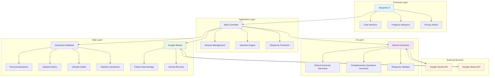
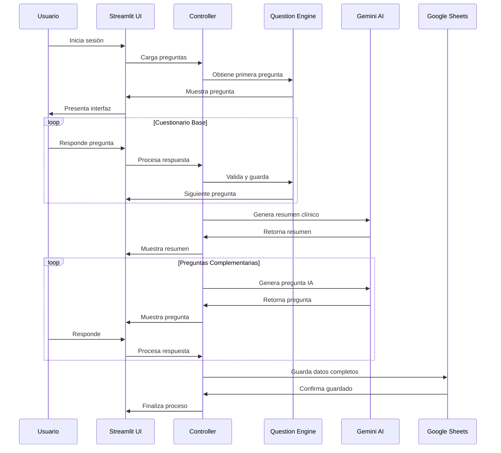

# 🏗️ Arquitectura del Sistema - Chatbot Lina v2.0

## Diagrama de Arquitectura

## Flujo de Datos

## Componentes del Sistema

### 🎨 Frontend Layer
- **Streamlit UI**: Interfaz principal de usuario
- **Chat Interface**: Sistema de mensajería interactiva
- **Progress Indicators**: Indicadores visuales de progreso
- **Privacy Notice**: Aviso de privacidad y consentimiento

### ⚙️ Application Layer
- **Main Controller**: Controlador principal del flujo
- **Session Management**: Gestión de estado de sesión
- **Question Engine**: Motor de preguntas y lógica condicional
- **Response Processor**: Procesador de respuestas del usuario

### 🤖 AI Layer
- **Gemini Connector**: Conector principal con Google Gemini
- **Clinical Summary Generator**: Generador de resúmenes clínicos
- **Complementary Questions Generator**: Generador de preguntas dinámicas
- **Response Validator**: Validador de respuestas médicas

### 💾 Data Layer
- **Questions Database**: Base de datos de preguntas médicas
  - Personal Questions: Datos demográficos
  - Medical History: Antecedentes médicos
  - Lifestyle Habits: Hábitos de vida
  - Diabetes Symptoms: Síntomas diabéticos
- **Google Sheets**: Almacenamiento de datos
  - Patient Data Storage: Datos de pacientes
  - Clinical Records: Registros clínicos

### 🌐 External Services
- **Google Gemini API**: Servicio de IA para análisis médico
- **Google Sheets API**: Servicio de almacenamiento en la nube

## Patrones de Diseño Utilizados

### 1. **MVC (Model-View-Controller)**
- **Model**: Preguntas y datos de pacientes
- **View**: Interfaz de Streamlit
- **Controller**: Lógica de negocio en el controlador principal

### 2. **Strategy Pattern**
- Diferentes estrategias para generar preguntas (estructuradas vs. IA)
- Validación de respuestas con múltiples criterios

### 3. **Observer Pattern**
- Sistema de eventos para actualizar la interfaz
- Notificaciones de cambios de estado

### 4. **Factory Pattern**
- Creación de conectores para diferentes servicios
- Generación de preguntas basadas en contexto

## Consideraciones de Seguridad

### 🔐 Autenticación y Autorización
- API Keys almacenadas en `secrets.toml`
- Service Account para Google Sheets
- Validación de permisos en cada operación

### 🛡️ Protección de Datos
- Exclusión de datos personales del historial clínico
- Encriptación en tránsito (HTTPS)
- Almacenamiento seguro en Google Cloud

### 🔒 Privacidad
- Aviso de privacidad obligatorio
- Consentimiento explícito del usuario
- Uso exclusivo para fines médicos

## Escalabilidad y Rendimiento

### 📈 Escalabilidad Horizontal
- Arquitectura stateless para fácil escalamiento
- Separación de responsabilidades por capas
- Uso de servicios externos para IA y almacenamiento

### ⚡ Optimizaciones de Rendimiento
- Caché de preguntas en memoria
- Llamadas asíncronas a APIs
- Sistema de reintentos para APIs externas
- Lazy loading de componentes

### 🔄 Manejo de Errores
- Sistema robusto de reintentos
- Fallbacks para servicios externos
- Logging detallado de errores
- Recuperación automática de fallos

## Monitoreo y Observabilidad

### 📊 Métricas Clave
- Tiempo de respuesta de APIs
- Tasa de éxito de preguntas
- Número de sesiones activas
- Errores por componente

### 📝 Logging
- Logs estructurados por capa
- Trazabilidad de sesiones
- Alertas automáticas para errores críticos

### 🔍 Debugging
- Modo debug para desarrollo
- Trazabilidad de flujo de datos
- Herramientas de diagnóstico integradas
